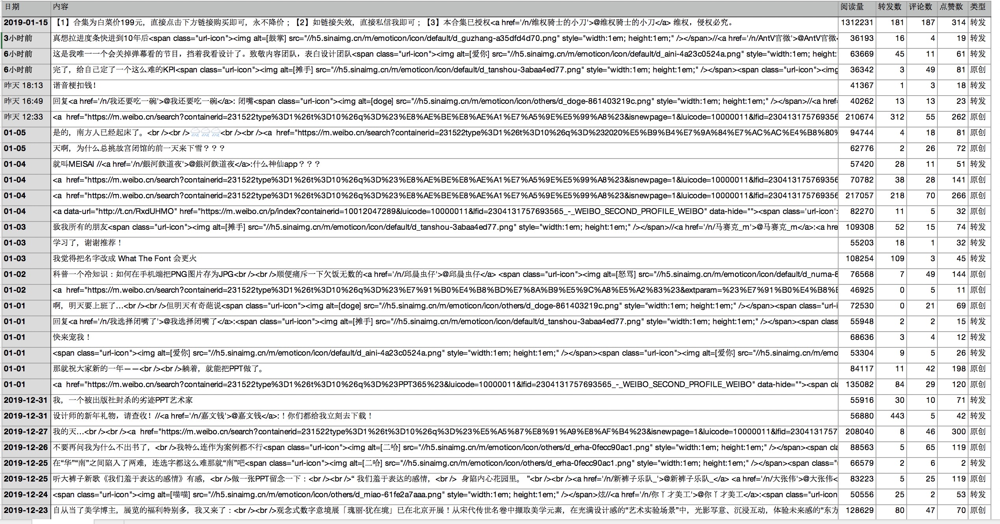

# WEIBOSpider
This is project that capture sina weibo datas

# 第一种方式
参考博文 https://www.jianshu.com/p/f65829b22b91  
利用http://weibo.cn/{user_id}/profile?page={page_index}来分页获取某用户的微博内容

原理就是抓页面html元素来获取数据

# 第二种方式
移动端微博的API:https://m.weibo.cn/api/container/getIndex?containerid={containerid}_-_WEIBO_SECOND_PROFILE_WEIBO&page_type=03&page={page}   
可通过get方法请求上面的API，再将数据结构JSON反序列化一下，直接从API结果获取数据。
## 阅读量数据获取
```
    if 'reads_count' in mblog:
        list1.append(mblog['reads_count'])
    else:
        list1.append(0)
```
如上代码，`reads_count`只有在当前cookie和爬取的微博账户是同一个账号时才起作用，因为微博只有自己才能看到个人微博阅读量。爬取非cookie账户的微博时阅读量默认是0。

# 导出csv
会在根目录下导出一个user_id名称的csv文件


# demo
## userid和cookie一致

## userid和cookie不一致

